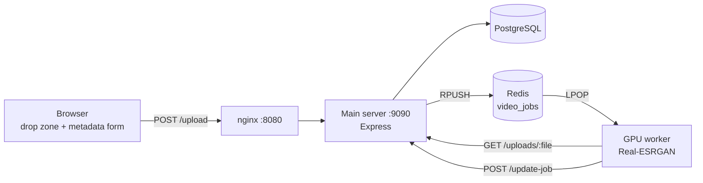

# anime4kzone

[](https://github.com/FrostOnFire/anime4kzone/actions/workflows/ci.yml)

A distributed pipeline for upscaling anime episodes. A browser uploads an
episode, a main server records its metadata and queues the job, and a rented
GPU machine picks the job up and runs [Real-ESRGAN](https://github.com/xinntao/Real-ESRGAN)
over it.

The work is split across three machines because the GPU was the expensive part:
it was rented by the hour and had to stay independent of the always-on server
holding the database and the uploads.



## How a job flows

1. The browser autocompletes the title against the [Shikimori](https://shikimori.one)
   GraphQL API, which fills in the cover, genres, episode count and rating.
   The uploader adds the episode number, franchise, dub and the timestamps of
   the opening, so a player can offer a skip later.
2. `POST /upload` stores the file, writes the metadata and pushes a job onto the
   `video_jobs` list in Redis. The client polls `/queue-status` for the queue
   length.
3. The GPU worker pops a job, downloads the source from the main server, and
   upscales it in a worker thread so the queue loop stays responsive. It runs
   the `realesr-animevideov3` model at 3x with 8 processes on the GPU.
4. The worker reports back to `POST /update-job`, which writes the episode into
   a five-table schema: `franchises`, `animes`, `genres`, `videos` and the
   `anime_genres` join table.

A single episode took a few hours to process, so demo clips were kept to 10-60
seconds.

## Layout

| Path | What it is |
|---|---|
| `main-server/` | Express server, upload UI, nginx and provisioning (PC-2) |
| `main-server/db/schema.sql` | The PostgreSQL schema |
| `main-server/public/` | Drop zone, metadata form and client logic |
| `gpu-worker/` | Queue consumer and the Real-ESRGAN wrapper (PC-3) |
| `*/*.service` | systemd units, installed by the provisioning scripts |
| `docs/architecture.md` | Endpoints, data model and design notes |

Real-ESRGAN is not vendored here. `gpu-worker/setup.sh` installs it from
upstream, pinned to the v0.3.0 the worker was built against.

## Running it

Both nodes are provisioned by script on Ubuntu:

```bash
# Main server (PC-2): nginx, PostgreSQL, Redis, the Express app
cp main-server/.env.example main-server/.env   # then fill it in
./main-server/script.sh
psql -U "$DB_USER" -d "$DB_NAME" -f main-server/db/schema.sql
sudo systemctl start anime4kzone

# GPU node (PC-3): CUDA-capable, Real-ESRGAN, the worker
cp gpu-worker/.env.example gpu-worker/.env     # point it at the main server
./gpu-worker/setup.sh
sudo systemctl start anime4kzone-worker
```

Both scripts install a systemd unit, so each node restarts on failure and comes
back after a reboot. Logs go to the journal:
`journalctl -u anime4kzone -f`.

nginx serves the client and proxies every API call to the Express server, so
the two are same-origin and nothing but port 8080 needs to be exposed.

## Status

The pipeline worked end to end: uploads were queued, upscaled on the GPU node
and written back to the database. Three things were planned and never built,
and the code says so where it matters:

- **No streaming site.** Episodes were processed and recorded, but the viewing
  front end for them was never written.
- **No cloud upload.** `uploadToGoogleCloud` in the worker returns a placeholder
  URL, so results stayed on the GPU node.
- **No surviving samples.** The short before/after clips were not kept.

The worker has been untouched since 2024 and is written against the node-redis
v3 callback API, while the main server moved on to the v4 promise API; each
manifest pins its own version accordingly.

## Stack

Node.js, Express, PostgreSQL, Redis, nginx, Real-ESRGAN (PyTorch, CUDA),
Shikimori GraphQL API, Dropzone.js.

## License

MIT — see [LICENSE](LICENSE).
