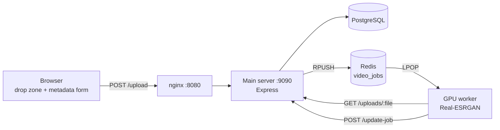

# anime4kzone

[](https://github.com/FrostOnFire/anime4kzone/actions/workflows/ci.yml)

Upscales anime episodes across three machines. You drop a file into the browser,
the main server saves it and puts a job on a queue, and a rented GPU box picks
the job up and runs [Real-ESRGAN](https://github.com/xinntao/Real-ESRGAN) over it.

Three machines because GPU time is the part that costs money. The GPU was rented
by the hour, so nothing that needed to survive a reboot could live on it: the
database, the uploads and the queue all sit on the always-on server instead.



## How a job flows

1. You start typing a title and the browser autocompletes it against the
   [Shikimori](https://shikimori.one) GraphQL API, which fills in the cover,
   genres, episode count and rating. You add the episode number, the franchise,
   which dub it is, and where the opening starts, so a player can skip it later.
2. `POST /upload` saves the file, writes the metadata and pushes a job onto the
   `video_jobs` list in Redis. The page polls `/queue-status` to show how many
   jobs are waiting.
3. The worker pops a job, downloads the source, and upscales it in a worker
   thread so the queue loop keeps running. The model is `realesr-animevideov3`
   at 3x, eight processes on the GPU.
4. The worker posts back to `/update-job`, which writes the episode into five
   tables: `franchises`, `animes`, `genres`, `videos`, and `anime_genres` to
   link the last two.

## Layout

| Path | What it is |
|---|---|
| `main-server/` | Express server, upload UI, nginx and provisioning (PC-2) |
| `main-server/db/schema.sql` | The PostgreSQL schema |
| `main-server/public/` | Drop zone, metadata form and client logic |
| `gpu-worker/` | Queue consumer and the Real-ESRGAN wrapper (PC-3) |
| `*/*.service` | systemd units, installed by the provisioning scripts |
| `docs/architecture.md` | Endpoints, data model and design notes |

Real-ESRGAN is not vendored here. `gpu-worker/setup.sh` clones it from upstream
and checks out v0.3.0, which is what the worker was built against.

## Running it

Both nodes have a provisioning script, written for Ubuntu:

```bash
# Main server (PC-2): nginx, PostgreSQL, Redis, the Express app
cp main-server/.env.example main-server/.env   # then fill it in
./main-server/script.sh
psql -U "$DB_USER" -d "$DB_NAME" -f main-server/db/schema.sql
sudo systemctl start anime4kzone

# GPU node (PC-3): CUDA-capable, Real-ESRGAN, the worker
cp gpu-worker/.env.example gpu-worker/.env     # point it at the main server
./gpu-worker/setup.sh
sudo systemctl start anime4kzone-worker
```

Each script installs a systemd unit, so a node restarts if it crashes and comes
back after a reboot. Logs go to the journal: `journalctl -u anime4kzone -f`.

nginx serves the page and proxies every API call through to Express, so both
are on the same origin and only port 8080 is open to the outside.

## What works and what doesn't

The pipeline ran end to end: upload, queue, upscale on the GPU node, write the
result back to Postgres. One episode took a few hours, which is why the demo
clips were only 10-60 seconds long.

Three things never got built. There is no site to actually watch the episodes
on, which was the original idea and the part I never wrote.
`uploadToGoogleCloud` in the worker is a stub that hands back a fake URL, so
finished files stayed on the GPU node instead of going anywhere. And the
before/after clips are gone. I did not keep them.

The worker has not been touched since 2024. It talks to Redis through the
node-redis v3 callback API while the main server has moved on to v4 promises,
so each side pins its own version.

## Stack

Node.js, Express, PostgreSQL, Redis, nginx, Real-ESRGAN (PyTorch, CUDA),
Shikimori GraphQL API, Dropzone.js.

## License

MIT, see [LICENSE](LICENSE).
